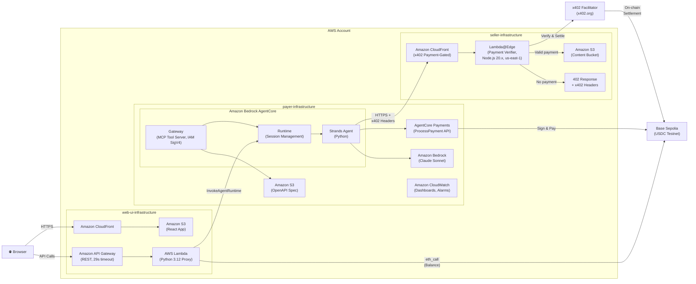

# x402 Payments using Amazon Bedrock AgentCore

HTTP 402 payment-gated content delivery using AWS Bedrock AgentCore and AgentCore Payments, paying a seller operating on CloudFront, Lambda@Edge, and S3.

> **Update — May 7, 2026:** AWS has launched [Amazon Bedrock AgentCore Payments](https://docs.aws.amazon.com/bedrock-agentcore/latest/devguide/) (Preview) — bringing native, managed payment capabilities to AI agents built on Amazon Bedrock. AgentCore Payments lets agents autonomously discover, authorize, and execute x402 micropayments with built-in wallet management, policy-based spending controls, and a full audit trail — no custom payment infrastructure required. The architectures and reference implementations described in this repo now integrate directly with AgentCore Payments. [Get started with AgentCore Payments.](https://docs.aws.amazon.com/bedrock-agentcore/latest/devguide/)

## Overview

This project demonstrates a payment-gated content delivery system using the [x402 protocol](https://github.com/coinbase/x402):

- **Payer**: AI agent on Bedrock AgentCore Runtime with AgentCore Payments (ProcessPayment API)
- **Seller**: CloudFront + Lambda@Edge for x402 payment verification
- **Web UI**: React demo interface

## Architecture

| Agent requests content and receives a 402 payment challenge | Agent pays and content is delivered |
|:---:|:---:|
|  |  |



Three CDK stacks deploy into a single AWS account:
- **web-ui-infrastructure** — CloudFront + S3 for the React app, API Gateway + Lambda proxy to AgentCore
- **payer-infrastructure** — IAM roles (including AgentCore Payments roles), CloudWatch observability for Bedrock AgentCore (Runtime, Gateway, Agent)
- **seller-infrastructure** — CloudFront + Lambda@Edge for x402 payment-gated content, S3 content bucket

AgentCore Gateway acts as an MCP tool server:
- Content endpoints exposed as discoverable MCP tools via OpenAPI spec
- Agent discovers tools at runtime via MCP protocol
- x402 payment headers pass through to CloudFront
- Agent handles 402 responses and payment signing

## Payment Flow

The Web UI guides users through a 3-step payment process:

1. **Step 1: Request Content**
   - User selects content item
   - Agent requests content from CloudFront
   - Lambda@Edge returns `402 Payment Required` with x402 headers
   - Agent extracts x402_payload and reports payment requirements

2. **Step 2: Confirm Payment**
   - User confirms payment
   - Agent calls ProcessPayment via AgentCore Payments (passes x402_payload as-is)
   - AgentCore signs the transaction server-side
   - Agent retries request with payment proof header (X-PAYMENT or PAYMENT-SIGNATURE)
   - Lambda@Edge verifies signature via x402 facilitator
   - Facilitator settles payment on-chain
   - Agent confirms successful payment

3. **Step 3: View Content**
   - User clicks to view purchased content
   - Agent presents the content data in readable format
   - Transaction hash available for block explorer verification

## Stack

| Component | Technology |
|-----------|------------|
| Agent Framework | [Strands Agents SDK](https://strandsagents.com/) (Python) |
| Agent Runtime | [Amazon Bedrock AgentCore](https://docs.aws.amazon.com/bedrock-agentcore/) |
| Tool Discovery | MCP Protocol via Gateway |
| LLM | Amazon Bedrock (Claude Sonnet) |
| Payments | [Amazon Bedrock AgentCore Payments](https://docs.aws.amazon.com/bedrock-agentcore/) (ProcessPayment API) |
| Content Delivery | CloudFront + Lambda@Edge |
| Payment Protocol | [x402](https://github.com/coinbase/x402) |
| Network | Base Sepolia (testnet) |
| Web UI | React + Vite + TypeScript |

## Project Structure

```
sample-agentcore-cloudfront-x402-payments/
├── payer-agent/              # AI Agent (Python) - Strands agent with AgentCore Payments
│   ├── agent/                # Agent implementation & tools
│   ├── openapi/              # OpenAPI specs for Gateway targets
│   ├── scripts/              # Deployment & test scripts
│   └── tests/                # Test suite
│
├── payer-infrastructure/     # CDK Stack for AgentCore Runtime + Payments IAM
│   └── lib/
│       ├── agentcore-stack.ts
│       └── observability-stack.ts
│
├── seller-infrastructure/    # CDK Stack for x402 Payment API ← Agent calls this
│   ├── lib/
│   │   ├── cloudfront-stack.ts
│   │   └── lambda-edge/
│   │       ├── payment-verifier.ts  # x402 payment verification
│   │       └── content-config.ts    # Content & pricing config
│   └── content/              # S3-backed content files
│
├── web-ui/                   # React Frontend (Vite + TypeScript)
│   └── src/
│       ├── api/              # Agent & Gateway clients
│       ├── components/       # UI components
│       └── hooks/            # React hooks
│
├── web-ui-infrastructure/    # CDK Stack for Web UI hosting ← Browser loads this
│   └── lib/
│       ├── web-ui-stack.ts   # CloudFront + S3 + API Gateway
│       └── lambda/           # API proxy for AgentCore
│
├── agentcore-payments-beta/  # AgentCore Payments quickstart & reference
├── scripts/                  # Setup & verification scripts
└── docs/                     # Documentation
```

### Two CloudFront Distributions

This project deploys **two separate CloudFront distributions** for different purposes:

| Stack | CloudFront Purpose | Called By |
|-------|-------------------|-----------|
| `seller-infrastructure` | Payment-gated API (returns 402, verifies payments) | AI Agent |
| `web-ui-infrastructure` | Static React app hosting | Browser |

The Web UI (browser) → Agent → Seller API for ease of use.

### Deployed URLs

After deployment, you'll have URLs for each component:

| Component | URL Pattern | Purpose |
|-----------|-------------|---------|
| Web UI | `https://<distribution-id>.cloudfront.net` | React frontend |
| Content API | `https://<distribution-id>.cloudfront.net` | x402-protected endpoints |
| API Gateway | `https://<api-id>.execute-api.<region>.amazonaws.com/prod/` | AgentCore proxy |

Get your URLs from CDK deployment outputs or CloudFormation console.

### Wallet Addresses (Base Sepolia Testnet)

| Role | Source | Description |
|------|--------|-------------|
| Payer (Agent) | AgentCore Payments | Created via CreatePaymentInstrument API |
| Seller | Your own wallet | Set `PAYMENT_RECIPIENT_ADDRESS` in `seller-infrastructure/.env` |

The payer wallet is managed by AgentCore Payments — the agent never sees private keys. Fund it with USDC at https://faucet.circle.com/ (Base Sepolia).

## Agent Tools

Built-in tools:

| Tool | Description |
|------|-------------|
| `process_payment` | Execute x402 payment via AgentCore Payments ProcessPayment API |
| `request_content` | Request content (detects 402, returns raw x402_payload) |
| `request_content_with_payment` | Retry with payment proof header (auto-backoff) |

Service discovery tools:

| Tool | Description |
|------|-------------|
| `discover_services` | Find available paid services from Gateway |
| `request_service` | Request any discovered service by name |
| `list_approved_services` | List pre-approved services for autonomous purchasing |
| `check_service_approval` | Check if a purchase is pre-approved |

MCP tools (discovered via Gateway at `/mcp/tools`):

| Tool | Price (USDC) | Description |
|------|--------------|-------------|
| `get_premium_article` | 0.001 | AI/blockchain article |
| `get_weather_data` | 0.0005 | Weather conditions |
| `get_market_analysis` | 0.002 | Crypto market data |
| `get_research_report` | 0.005 | Blockchain research |
| `get_dataset` | 0.01 | ML dataset |
| `get_tutorial` | 0.003 | Smart contract tutorial |

## Prerequisites

- AWS Account with Bedrock AgentCore access
- AgentCore Payments setup completed (see `agentcore-payments-beta/quickstart/`)
- [Coinbase Developer Platform](https://portal.cdp.coinbase.com/) API keys (for credential provider setup)
- Node.js 18+, Python 3.10+
- AWS CDK CLI
- Docker (for agent deployment to AgentCore)

See [QUICKSTART.md](QUICKSTART.md) for a streamlined deployment guide.

## Quick Start

### 1. Clone and setup

```bash
git clone https://github.com/aws-samples/sample-agentcore-cloudfront-x402-payments
cd sample-agentcore-cloudfront-x402-payments
```

### 2. Configure credentials

```bash
# Payer agent - set AgentCore Payments config
cp payer-agent/.env.example payer-agent/.env
# Edit payer-agent/.env → set MANAGER_ARN, PAYMENT_SESSION_ID, etc.

# Seller infrastructure - set your wallet address
cp seller-infrastructure/.env.example seller-infrastructure/.env
# Edit seller-infrastructure/.env → set PAYMENT_RECIPIENT_ADDRESS
```

### 3. Deploy seller infrastructure

```bash
cd seller-infrastructure
npm install
npx cdk bootstrap  # First time only
npx cdk deploy
```

### 4. Set up AgentCore Payments

```bash
cd agentcore-payments-beta/quickstart
cp .env.sample .env
# Fill in Coinbase CDP keys
bash setup_roles.sh && bash setup_model.sh && bash setup_manager.sh
```

### 5. Deploy payer infrastructure

```bash
cd payer-infrastructure
npm install
npx cdk bootstrap  # First time only
npx cdk deploy --all
```

### 6. Deploy payer agent

```bash
cd payer-agent
python -m venv .venv
source .venv/bin/activate
pip install -e ".[dev]"
python scripts/deploy_to_agentcore.py
```

### 7. Run Web UI

```bash
# Configure the web UI
cp web-ui/.env.example web-ui/.env.local
# Edit web-ui/.env.local:
#   VITE_API_ENDPOINT=http://localhost:8080        (local backend API server)
#   VITE_AWS_REGION=us-west-2                      (your AWS region)
#   VITE_SELLER_URL=https://dXXXXXXXXXXXXX.cloudfront.net  (from step 3)

# In one terminal, start the backend API server:
cd sample-agentcore-cloudfront-x402-payments/payer-agent
source .venv/bin/activate
python -m agent.api_server

# In another terminal, start the frontend:
cd sample-agentcore-cloudfront-x402-payments/web-ui
npm install
npm run dev
```

### 8. Test

```bash
cd sample-agentcore-cloudfront-x402-payments/payer-agent
pytest

# Integration tests
SELLER_API_URL=$(grep SELLER_API_URL .env | cut -d= -f2) pytest -m integration

# Invoke agent
python scripts/invoke_gateway.py "Get me the premium article"
```

## Web UI

The React frontend provides a step-by-step interface for the x402 payment flow:

- **Wallet Display**: Shows agent wallet address and USDC balance on Base Sepolia
- **Content Grid**: 6 content items with pricing (0.0005 - 0.01 USDC)
- **3-Step Flow**: Request → Pay → View, each step is a separate agent call
- **Debug Panel**: Shows HTTP requests/responses for transparency
- **Agent Response**: Displays agent reasoning at each step

The step-by-step approach keeps each API call under the 29-second timeout limit while providing clear visibility into the payment process.

### Production Deployment (Optional)

To host the Web UI on CloudFront + S3 instead of running locally:

```bash
cd web-ui-infrastructure
npm install
npx cdk bootstrap  # First time only
npx cdk deploy
```

## Tests

```bash
cd payer-agent
source .venv/bin/activate

pytest                                    # All tests
pytest tests/test_402_response.py -v      # 402 handling
pytest tests/test_payment_analysis.py -v  # Payment decisions
pytest tests/test_payment_signing.py -v   # Wallet signing
pytest tests/test_content_delivery.py -v  # Content retrieval
pytest tests/test_error_scenarios.py -v   # Error handling
```

## Observability

- CloudWatch Dashboards
- OpenTelemetry tracing
- Structured JSON logging
- EMF metrics from Lambda@Edge

## Security

- IAM SigV4 authentication via AgentCore Gateway
- Wallet keys stored in AgentCore Identity (agent never sees private keys)
- 4-role IAM model: agent can only call ProcessPayment, not create sessions or instruments
- Session-level spending limits enforced server-side
- Cryptographic signature validation via x402 facilitator
- Session isolation in AgentCore Runtime

> **⚠️ Web UI Security Notice:** The deployed Web UI (CloudFront + API Gateway) does not include authentication. Anyone with the URL can trigger agent invocations that spend from the connected wallet. This is intentional for demo purposes on Base Sepolia testnet. **Do not deploy with a mainnet wallet or real funds without adding authentication** (e.g., Amazon Cognito, API keys, or IAM auth on API Gateway). If you deploy the Web UI publicly, treat the URL as sensitive and restrict access accordingly.

## Known Issues

- **Python 3.14 + httpcore/anyio incompatibility:** Integration tests that make real HTTP calls via `httpx` fail on Python 3.14 (pre-release) with `TypeError: cannot create weak reference to 'NoneType' object` in `httpcore/_async/connection_pool.py`. Unit tests (which mock HTTP) are unaffected. Use Python 3.12 or 3.13 for integration tests until upstream `httpcore`/`anyio` releases fix this.

## References

- [x402 Protocol Specification](https://github.com/coinbase/x402/tree/main/specs)
- [x402 CloudFront + Lambda@Edge Example](https://github.com/coinbase/x402/tree/main/examples/typescript/servers/cloudfront-lambda-edge) — the seller infrastructure in this project is based on this example
- [Strands Agents Documentation](https://strandsagents.com/latest/documentation/docs/)
- [Bedrock AgentCore Documentation](https://docs.aws.amazon.com/bedrock-agentcore/latest/devguide/)
- [EIP-3009: Transfer With Authorization](https://eips.ethereum.org/EIPS/eip-3009)

## Creating a Seller Wallet

You need a wallet address on Base Sepolia to receive payments. Options:

1. **CDP Portal** (recommended): Create at [portal.cdp.coinbase.com](https://portal.cdp.coinbase.com/)
2. **MetaMask**: Add Base Sepolia network and use your address
3. **Any EVM wallet**: Any wallet that supports Base Sepolia testnet

Set your wallet address in `seller-infrastructure/.env`:
```bash
PAYMENT_RECIPIENT_ADDRESS=<YOUR_WALLET_ADDRESS>
```
## Security

See [CONTRIBUTING](CONTRIBUTING.md) for more information.

## License

This library is licensed under the MIT-0 License. See the LICENSE file.
